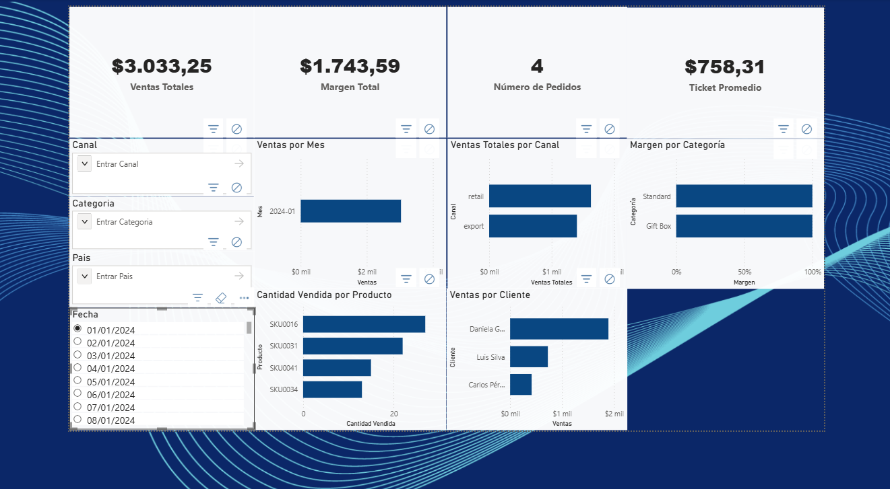
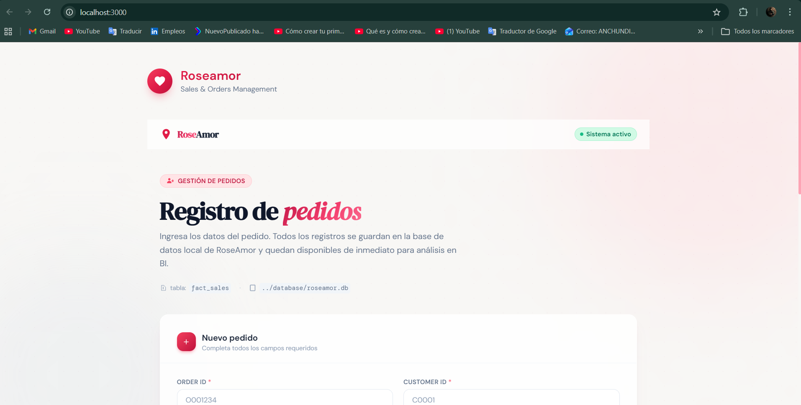
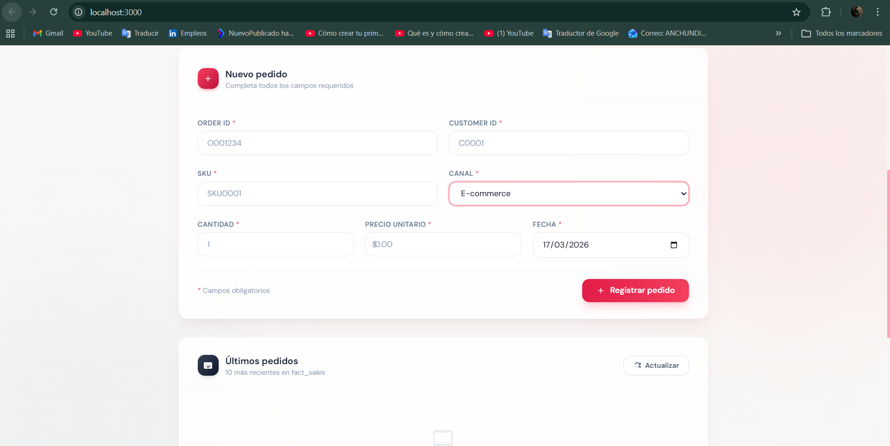

# 🌹 RoseAmor Data Engineering Challenge

## 🚀 Demo visual

### 📊 Dashboard Power BI


### 🌐 Web App



---

## 📌 Descripción

Solución completa para transformar datos crudos en información confiable para análisis y gestión de pedidos.

Incluye:

- ETL de datos (Python)
- Base de datos SQLite
- Dashboard en Power BI
- Aplicación web para registro de pedidos (Next.js)

---

## 🏗️ Arquitectura

```

CSV (data/)
↓
ETL (scripts/etl.py)
↓
SQLite (database/roseamor.db)
↓
Exports CSV (exports/)
↓
Power BI Dashboard
↓
Web App (Next.js)

````

---

## 🧹 Limpieza de datos

Problemas detectados y soluciones aplicadas:

- Costos negativos en productos → convertidos a valor absoluto (ABS), ya que un costo negativo no es válido en un contexto financiero y afectaría el cálculo de margen  
- Registros duplicados → eliminados para evitar doble conteo en métricas  
- Valores nulos → eliminados en campos críticos para asegurar integridad de datos  
- Fechas inválidas → filtradas para mantener consistencia temporal en el análisis  
- Relaciones inválidas (customer_id / sku) → excluidas para garantizar integridad referencial en el modelo  

---

## 🗃️ Modelo de datos

Se implementó un modelo tipo estrella con tablas de hechos y dimensiones:

### Tablas:

- `dim_customers`
- `dim_products`
- `fact_sales`

### Relaciones:

- `fact_sales.customer_id → dim_customers.customer_id`
- `fact_sales.sku → dim_products.sku`

Este diseño permite un análisis eficiente en herramientas de BI.

---

## 🧠 Decisiones técnicas

- Se utilizó **SQLite** por simplicidad, portabilidad y facilidad de uso en entornos de prueba  
- Se implementó un modelo tipo estrella para optimizar consultas analíticas  
- Se separó el proceso ETL del consumo (BI y app) para mayor escalabilidad  
- Se generaron archivos intermedios (`exports/`) para facilitar integración con Power BI  

---

## ⚙️ Cómo ejecutar

### 1. Instalar dependencias

```bash
pip install pandas
````

---

### 2. Ejecutar ETL

```bash
python scripts/etl.py
```

Esto:

* crea la base SQLite (`roseamor.db`)
* limpia los datos
* carga las tablas
* genera archivos en `/exports`

---

## 📊 Dashboard (Power BI)

Archivo incluido:

```
RoseAmor_Dashboard.pbix
```

### KPIs:

* Ventas totales
* Margen total
* Número de pedidos
* Ticket promedio

### Visualizaciones:

* Ventas por mes
* Ventas por canal
* Margen por categoría
* Top 10 clientes por ingresos
* Top 10 productos más vendidos

### Filtros:

* Fecha
* Canal
* Categoría
* País

---

## 🌐 Web App

Ubicación:

```
web/
```

### Ejecutar:

```bash
cd web
npm install
npm run dev
```

Abrir en navegador:

```
http://localhost:3000
```

---

## 🧾 Registro de pedidos

La aplicación permite:

* registrar nuevos pedidos
* validar datos (campos obligatorios, valores positivos, formato de fecha)
* almacenar información en SQLite (`fact_sales`)

---

## 🔄 Actualización de datos

Si se reciben nuevos archivos CSV:

1. Reemplazar archivos en `/data`
2. Ejecutar:

```bash
python scripts/etl.py
```

3. Actualizar el dashboard en Power BI

---

## ✅ Validación

Se verificó que:

* los datos se cargan correctamente en la base SQLite
* los KPIs coinciden con los cálculos SQL
* los pedidos registrados desde la app se almacenan correctamente
* el dashboard refleja la información actualizada

---

